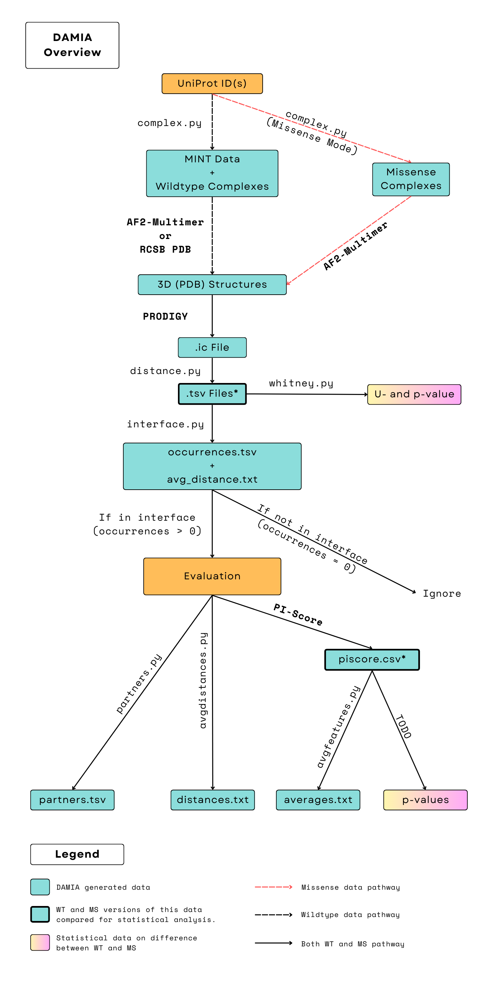

# DAMIA (Disease-Associated Missense Interactome Analysis)

DAMIA is a collection of tools for predicting the impact of missense mutations on direct Protein-Protein Interactions (PPIs). It is designed to work with PDB entries or AlphaFold output. The current version of DAMIA includes four main functionalities: distance calculation, interface determination, interaction partners, and Jaccard index similarity.

## Workflow Overview



## Features

- **Distance Calculation**: Computes the distances between alpha and beta carbons in protein structures.
- **Interface Determination**: Identifies whether a given chain-residue pair appears in interfaces based on interaction data (TSVs) and determines the frequency of their occurrence.
- **Interaction Partners**: Provides information on interaction partners for a chain-residue pair.
- **Jaccard Index Similarity**: Calculates Jaccard index similarity between interaction data TSV files.

## Input Formats

The tools in DAMIA primarily accept TSV files with specific headers. As a user, you will typically only need to input a PDB file. Most of the data processed by tools in this project is self-generated.

## Installation

### Dependencies

To use DAMIA, you will need to install the following dependencies:

1. [PI score](https://gitlab.com/topf-lab/pi_score)
2. [Prodigy](https://github.com/haddocking/prodigy)
3. [PyMOL](https://pymol.org/)

Please follow the installation steps provided in the respective links above.

### DAMIA

To install DAMIA, clone the repository and install the required packages:

```bash
# Clone the repository
git clone https://github.com/MurtoHilali/damia.git

# Change to the repository directory
cd damia

# Create a virtual environment (optional, but recommended)
python3 -m venv venv
source venv/bin/activate  # On Windows, use `venv\Scripts\activate`

# Install the required packages and the command-line tool
pip install -r requirements.txt
pip install -e .

# The command-line tool is now available as 'damia'

```

## Usage Examples

For specific usage examples and explanations of each tool, please refer to the documentation in the `/docs` directory, or an overview at the [Documentation Index](docs/index.md):

- [distance.md](docs/distance.md): Distance calculation between alpha and beta carbons
- [interface.md](docs/interface.md): Interface determination for chain-residue pairs
- [partners.md](docs/partners.md): Interaction partners of chain-residue pairs
- [similarity.md](docs/similarity.md): Jaccard index similarity calculation

## Pipeline Implementation

While DAMIA is not yet implemented as a fully autonomous pipeline, the repository comes with scripts that allow users to streamline the interaction comparison analysis

## Contributing

We welcome contributions to the project! If you have any suggestions for new features or improvements, feel free to open an issue or submit a pull request.

## License

This project is licensed under the [MIT License](LICENSE).

## TODO

* Create a script that runs statistical analysis the feature data for both WT and MS complexes (i.e. the CSV ouput from PI-Score)
* Standardize/combine the output 